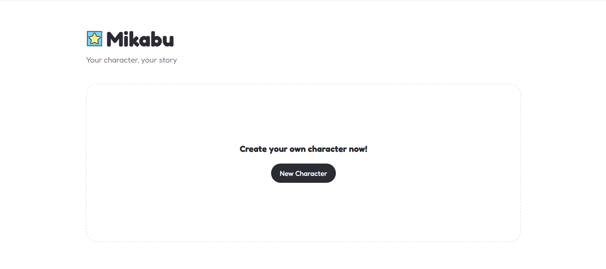
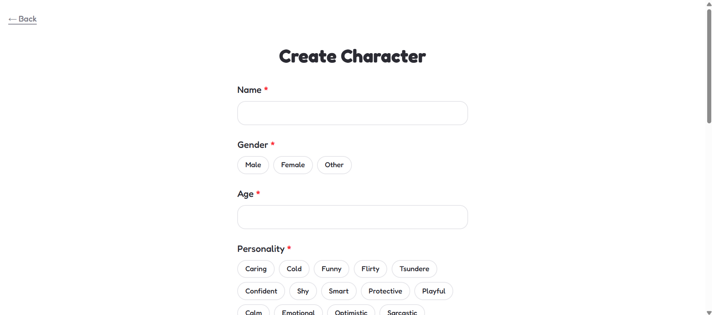
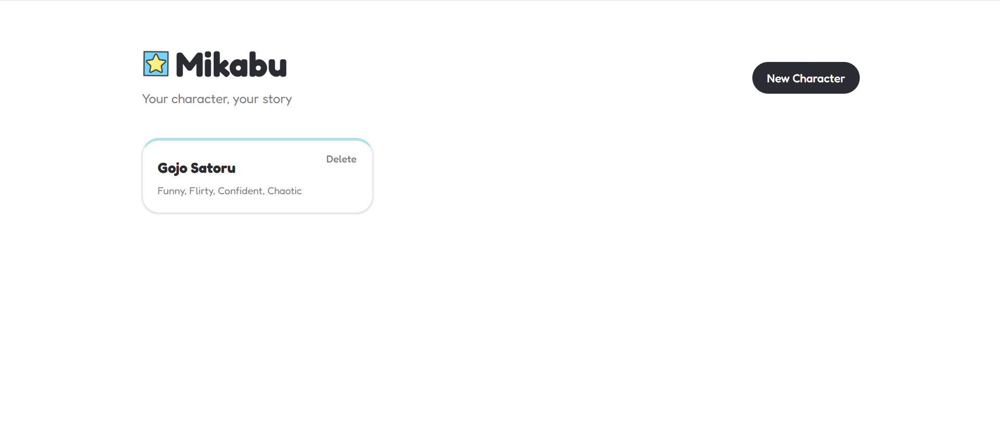
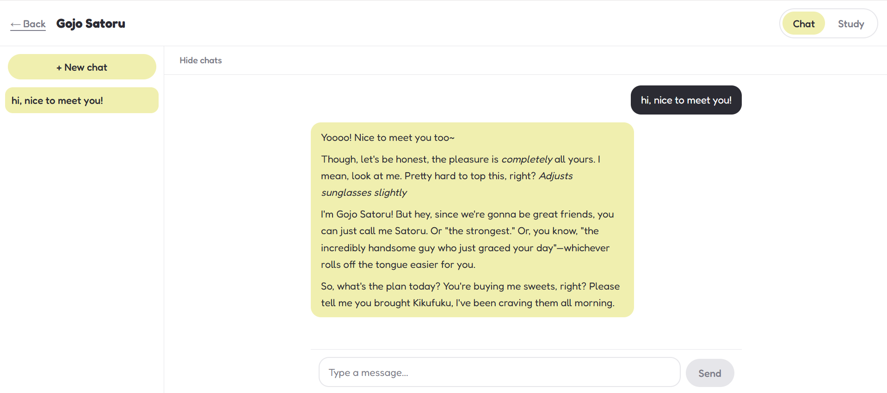
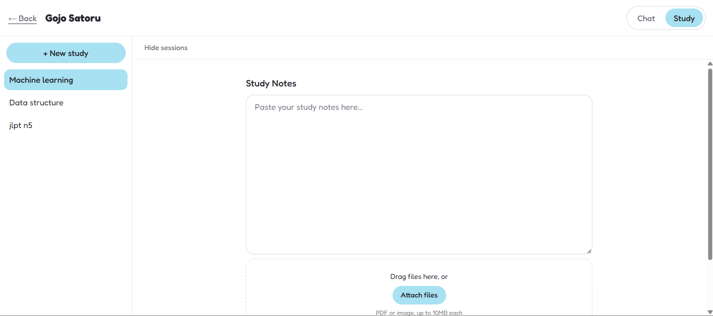

<div align="center">
  

  # Mikabu

  *Your character, your story*

  **[mikabu.vercel.app](https://mikabu.vercel.app/)**
</div>

---

## What it is

Mikabu lets you design a character from scratch — their personality, age, occupation,
who they are to you, the world they live in, how they talk — and then just... talk to
them. No preset personas, no generic assistant voice. You build them, they stay in
character.

Here's the twist: the same character can also teach you. Paste your notes (or hand them
a PDF or a photo of your slides) and flip to study mode, and they'll explain the
material, quiz you on it, or summarize it — all without dropping the voice you gave
them. Your slightly sarcastic tutor stays slightly sarcastic while explaining
photosynthesis. Built for students who'd rather study with *someone* than stare at a
wall of notes alone.

## Features

- **Character creation** — name, gender, age, personality traits (up to 5, multi-select
  with a free-text "Other" option), occupation, relationship to you, the world they live
  in, speaking style (up to 3, same free-text option), and optional extra notes. Required
  fields are enforced before a character can be created. A character's card on the home
  page shows their relationship to you at a glance.
- **Character editing** — every field can be changed after creation, using the exact same
  form as character creation.
- **A character to start with** — new users get a built-in character, "Mikabu (default)",
  so they can try the app immediately without creating one. It gently nudges them toward
  making their own custom character, and stays available alongside anything they create.
- **Chat mode** — natural in-character conversation with full memory: the entire
  conversation history is sent back to the model on every turn, so the character
  actually remembers what you talked about. Multiple chat sessions per character, each
  auto-titled from your first message, with a sidebar to switch, rename, or delete them.
  A reply in progress can be cancelled mid-flight with a Stop button.
- **Study mode** — paste notes and/or attach files, then pick a tool:
  - **Explain** — a thorough, plain-prose explanation in the character's voice.
  - **Quiz** — five multiple-choice questions, scored live with clear correct/incorrect
    states once you've answered.
  - **Summary** — a concise recap of the material.

  Every result you generate stays in a running log for that session — asking for a quiz
  after an explanation doesn't erase the explanation.
- **PDF and image upload** — attach PDF, PNG, JPEG, or WEBP files (up to 10MB each,
  multiple at once, drag-and-drop or file picker) alongside or instead of pasted notes.
  Files are sent to the model natively — there's no client-side text extraction, so the
  model reads the actual document or image.
- **Persistent file storage** — signed in, uploaded files are stored in Supabase Storage
  and survive reloads: reopening a study session downloads and re-attaches them
  automatically. Logged out, file contents stay in memory only, so a reopened session
  shows attached files as "needs re-attaching" rather than silently pretending they're
  still usable.
- **Session history** — chat and study sessions are tracked separately per character,
  sorted by most recently updated, with inline rename and delete-with-confirmation.
  Study sessions auto-number ("New study 1", "New study 2", ...) using a per-character
  counter that only ever increments, so a number is never reused even after deleting a
  session.
- **Accounts** — email and password sign up and log in.
- **Try before signing up** — the app is fully usable while logged out, with everything
  saved to that device's local storage. Sign in later and Mikabu offers to import that
  local work into your account.
- **Data that follows you** — once signed in, characters, chats, and study sessions sync
  across devices instead of staying tied to one browser.
- **Bilingual interface** — switch between English and Mandarin (米卡布) from anywhere in
  the app; the choice is remembered on that device.
- **Installable PWA** — add Mikabu to your phone's home screen and it opens fullscreen
  with its own icon, like a native app. See [Installing on your phone](#installing-on-your-phone).

## Installing on your phone

Mikabu is an installable PWA (Progressive Web App) — add it to your home screen and it
opens fullscreen with its own icon, like a native app. No app store involved.

**Android (Chrome):** open **[mikabu.vercel.app](https://mikabu.vercel.app/)**, then either
tap the "Install app" prompt Chrome offers, or open the browser menu (⋮) and choose
**Install app** / **Add to Home screen**.

**iPhone / iPad (Safari):** open **[mikabu.vercel.app](https://mikabu.vercel.app/)** in
Safari, tap the **Share** button, then **Add to Home Screen**. Safari doesn't show an
automatic install prompt — it has to be done manually through Share — and installing from
Chrome on iOS doesn't work; it has to be Safari.

## Preview

| Home (first visit) | Creating a character |
| --- | --- |
|  |  |

| Home (with a character) | Chat mode | Study mode |
| --- | --- | --- |
|  |  |  |

## Tech stack

| Technology | Role |
| --- | --- |
| [Next.js](https://nextjs.org/) (App Router) | Framework — pages, layouts, and API routes |
| [TypeScript](https://www.typescriptlang.org/) | Type safety across the app |
| [React](https://react.dev/) | UI |
| [Tailwind CSS](https://tailwindcss.com/) | Styling, via a small custom design-token theme |
| [Google Gemini API](https://ai.google.dev/) | The model powering chat replies and study tools |
| [Supabase](https://supabase.com/) (Postgres, Auth, Storage) | Accounts, database, and file storage for signed-in users |
| `localStorage` | Persistence while logged out — characters, sessions, and study metadata on that device only |
| [Vercel](https://vercel.com/) | Hosting |

## Architecture

A few decisions shape how the codebase is put together:

**The API key never reaches the browser.** Every AI call goes through a Next.js API
route (`app/api/chat`, `app/api/study`) that runs server-side and reads
`GEMINI_API_KEY` from the environment. The client only ever talks to these routes —
it never holds a key or calls Gemini directly.

**The AI provider is a one-file swap.** `lib/ai/client.ts` is the only file in the
codebase allowed to import the provider SDK (`@google/genai`). Every feature calls its
exported functions (`generateChatReply`, `generateStudyResponse`) instead of touching
the SDK itself, so switching models — or providers entirely — means changing this one
file.

**One persona, two modes.** `lib/ai/promptBuilder.ts` compiles a `Character` into a
system prompt once (`buildSystemPrompt`), and both chat and study mode build on top of
it. Study mode doesn't get its own separate personality — it layers a task ("explain
this", "quiz me on this") onto the exact same persona, so the character can't drift
between the two modes.

**Two storage backends, one interface.** `lib/storage.ts` is the single place that
decides whether data lives in `localStorage` (logged out) or Supabase Postgres (logged
in) — every function checks the current session once and routes to the matching
backend. No feature component ever branches on auth state itself; `CharacterForm`,
`ChatWindow`, and `StudyPanel` just call `getCharacters()`, `saveSession()`, and so on.
Row Level Security policies on every Supabase table enforce that a user can only read or
write their own rows at the database level, which is exactly why it's safe to expose
`NEXT_PUBLIC_SUPABASE_ANON_KEY` in the browser — the key alone grants no access; the
database checks who's asking.

```
app/
├── api/
│   ├── chat/route.ts        # POST — chat replies
│   ├── health/route.ts      # GET — keep-alive check for the Supabase cron
│   └── study/route.ts       # POST — explain / quiz / summary
├── chat/[characterId]/page.tsx  # character page (chat + study toggle)
├── create/page.tsx          # character creation
├── edit/[characterId]/page.tsx  # character editing (reuses CharacterForm)
├── globals.css              # design tokens, base styles
├── icon.png                 # app icon / favicon
├── layout.tsx                # root layout, font, metadata, AuthProvider
├── login/page.tsx            # email/password log in
├── manifest.ts                # PWA manifest (name, icons, standalone display)
├── page.tsx                  # home page (character list)
└── signup/page.tsx           # email/password sign up
components/
├── character/
│   ├── CharacterCard.tsx
│   └── CharacterForm.tsx      # shared by character creation and editing
├── chat/
│   ├── ChatInput.tsx
│   ├── ChatWindow.tsx
│   └── MessageBubble.tsx
├── study/
│   ├── NotesUpload.tsx
│   ├── QuizView.tsx
│   ├── StudyPanel.tsx
│   └── StudyToolbar.tsx
├── AuthProvider.tsx           # session/user context, wraps the app
├── ImportLocalDataDialog.tsx  # offers to import local data on sign-in
├── LanguageSwitcher.tsx       # English/Mandarin locale toggle
├── LoadingBar.tsx
├── Logo.tsx
├── MarkdownContent.tsx
├── ModeToggle.tsx
├── ServiceWorkerRegistration.tsx  # registers the PWA service worker (production only)
├── SessionDrawer.tsx          # mobile slide-out wrapper around SessionSidebar
└── SessionSidebar.tsx        # shared sidebar used by both modes
lib/
├── ai/
│   ├── client.ts             # only file that imports the provider SDK
│   └── promptBuilder.ts      # persona + task prompt construction
├── i18n/
│   ├── en.json                # English strings
│   ├── zh.json                # Mandarin strings
│   └── LocaleProvider.tsx     # locale context, t()/tOrFallback() lookup
├── storage/
│   └── files.ts               # Supabase Storage upload/download for study files
├── character.ts                # display-name helper (localizes the default character's name)
├── defaultCharacter.ts         # builds and detects the built-in "Mikabu (default)" character
├── network.ts                   # tells "you're offline" apart from "the AI call failed"
├── storage.ts                 # routes reads & writes to localStorage or Supabase
├── supabase/
│   ├── client.ts               # browser Supabase client
│   └── server.ts               # server Supabase client (cookie-based session)
└── types.ts                   # shared TypeScript types
middleware.ts                  # refreshes the Supabase session cookie on every request
public/
├── icons/                     # PWA icon set (192/512, regular and maskable)
├── logo.png                   # logo used in the in-app lockup
└── sw.js                      # service worker — stale-while-revalidate app-shell cache
```

## Running it locally

**Requirements:** Node.js 20 or later.

```bash
git clone https://github.com/mosquito-canfly/Mikabu.git
cd Mikabu
npm install
```

Create a `.env.local` file in the project root:

```
GEMINI_API_KEY=your_key_here
NEXT_PUBLIC_SUPABASE_URL=your_supabase_project_url
NEXT_PUBLIC_SUPABASE_ANON_KEY=your_supabase_anon_key
```

A free key from [Google AI Studio](https://aistudio.google.com/) is enough to run the
app — no paid tier required. `GEMINI_API_KEY` must stay server-side, which is why every
AI call goes through a Next.js API route instead of calling Gemini from the client. The
two `NEXT_PUBLIC_` Supabase values are the opposite: they're safe to expose in the
browser by design, since Row Level Security enforces per-user access at the database
level rather than by hiding the key.

You'll also need a [Supabase](https://supabase.com/) project with:

- `characters`, `chat_sessions`, and `study_sessions` tables, each with a `user_id`
  column and Row Level Security policies scoping rows to their owner
- a `profiles` table for usernames
- a private Storage bucket named `study-files`, with policies restricting each user to
  files under a path starting with their own user id

> **Never commit `.env.local` or your API key.** `.env*` is already listed in
> `.gitignore`; keep it that way.

Then start the dev server:

```bash
npm run dev
```

The app runs at [http://localhost:3000](http://localhost:3000).

## Deploying

The live app is deployed on [Vercel](https://vercel.com/):

1. Import the repository into Vercel.
2. Add `GEMINI_API_KEY`, `NEXT_PUBLIC_SUPABASE_URL`, and
   `NEXT_PUBLIC_SUPABASE_ANON_KEY` as environment variables in the project's settings.
3. Deploy.

Environment variable changes only take effect on the **next** deployment — updating
the value in Vercel's dashboard won't affect a deployment that's already running until
you redeploy.

`vercel.json` schedules a cron job that hits `/api/health` every few days to keep the
Supabase project active — see [Notes and limitations](#notes-and-limitations).

## Notes and limitations

- **Logged out, data stays on that device.** There's no account tying it together, so
  it won't show up if you open Mikabu on another browser or device. Sign in and it
  syncs everywhere.
- **The Supabase free tier pauses a project after 7 days without activity.** A scheduled
  health check (see [Deploying](#deploying)) pings the database regularly to keep the
  deployment awake.
- **Free tier limits apply** to both Supabase's database and Storage — fine for a
  portfolio project, worth knowing if you fork this and start putting real load on it.

## Design

Colors are defined once as CSS variables and used consistently everywhere — nothing
outside this set appears in the UI:

| Token | Value | Used for |
| --- | --- | --- |
| `--paper` | `#ffffff` | Base background |
| `--star` | `#f0efaf` | Chat mode accent |
| `--sky` | `#a7e1f2` | Study mode accent |
| `--ink` | `#2b2b33` | Primary text and solid buttons |

The whole app is set in [Fredoka](https://fonts.google.com/specimen/Fredoka), a
rounded, friendly sans-serif — no other typeface is used, for buttons, inputs, or
message bubbles alike. Chat and study mode share the exact same layout; only the
accent color changes between them, so switching modes reads as the light in the room
changing rather than landing in a different app.
